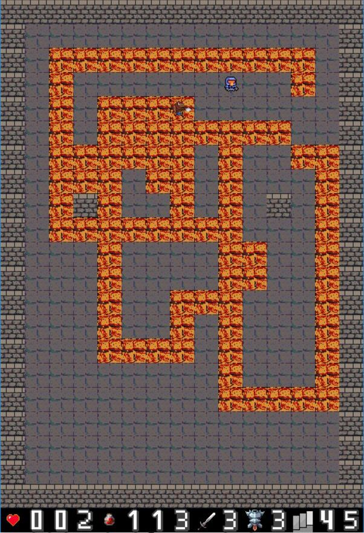
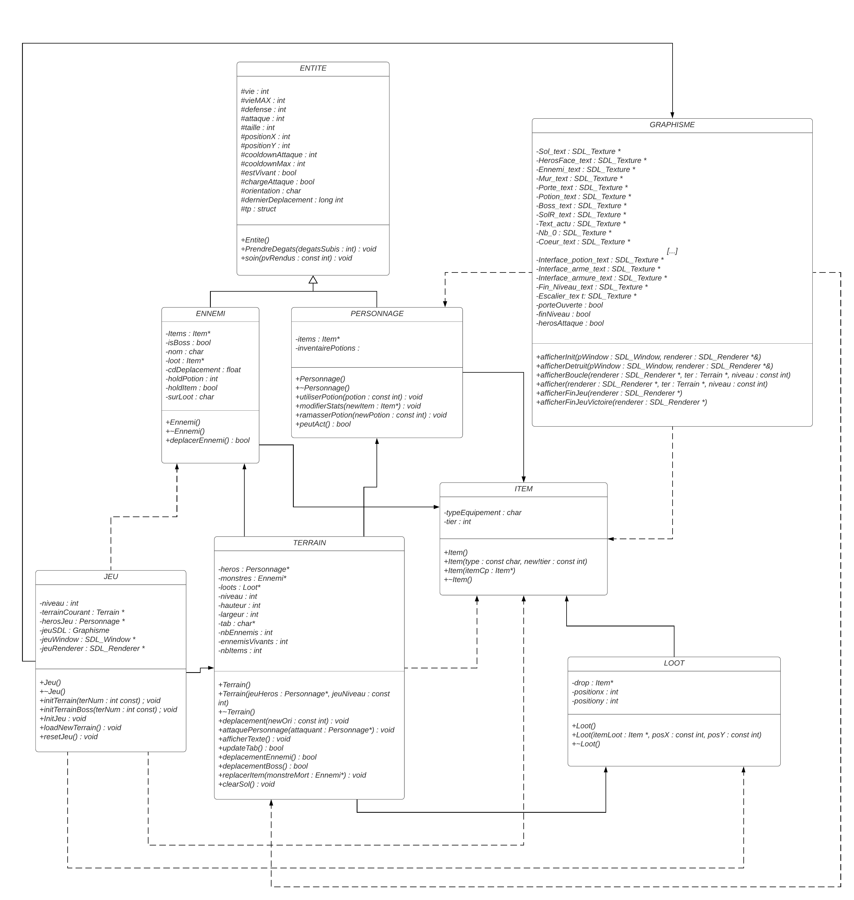

# Rogue Dungeon
#### Conception et développement d'applications

## Sujet

Projet réalisé dans le cadre de l'UE Conception et développement d'applications ([INF2015L](http://offre-de-formations.univ-lyon1.fr/ue-8157-952/conception-et-developpement-d'applications.html)) à l'Université Claude Bernard Lyon 1.  
Ce projet est le projet final de l'UE. L'objectif était de réalisé le jeu de notre choix en utilisant la [SDL2](https://www.libsdl.org/).
  

	

## Utilisation

Le projet doit être compilé avec **[CodeBlocks](https://www.codeblocks.org/) sous Windows**

> **Note**
> Une version Linux est en cours de développement.

## Fonctionnement du jeu

Le jeu est un Rogue Like dont le but est de **finir toutes les étages d'un donjon** (ici 50). Pour passer à l'étage suivant, il faut vaincre tous les ennemis du niveau pour faire apparaître la porte de sortie et arriver au niveau suivant.  
Afin d'aider à la progression, les ennemis peuvent, à leur mort, donner des **potions** (les petites redonnent 30 PV, les moyennes 60 PV et les grandes 90 PV) ainsi que de l'**équipement** dont la puissance est définie par son tier allant de 0 pour les équipements de départ à 3 (une épée, améliorant votre attaque ou une armure réduisant les dégats subis et augmentant vos points de vie).  
  
Tous les 5 niveaux, un boss est présent. Un boss est plus résistant et inflige plus de dégats. De plus, **il brûle le sol derrière lui**, ce qui vous inflige des dégats au joueur s'il marche dessus. 

Les ennemis sont plus de plus en plus résistants et rapides. Utilisez donc vos potions avec parcimonie.

## Commandes 
| Action | Touche |
| :- | :-: |
| avancer | **`z`** |
| gauche | **`q`** |
| reculer | **`s`** |
| droite | **`d`** |
| attaquer| **`espace`** |
| utiliser un petite potion | **`1`** |
| utiliser un moyenne potion | **`2`** |
| utiliser un grande potion | **`3`** |
| quitter | **`esc`** |

## Commandes de triche

Afin de faciliter les démos du jeu, des commandes de "triche" ont été ajoutées : 
- appuyer 3 fois de suite sur `+` vous fera passer automatiquement au niveau suivant.
- appuyer 3 fois de suite sur `-` vous équipera d'une arme et d'une armure de tier 3 et vous donnera 20 potions de chaque type.

# Diagramme de classes

## Auteurs
NOUVEL Alexandre  
JUSTIN Gabriel  
BERNOT Camille